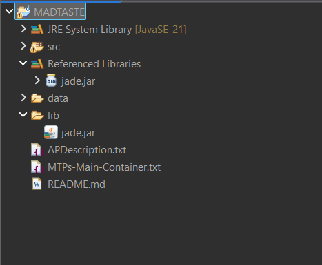

# MADTASTE

MADTASTE es un sistema multiagente desarrollado en Java con JADE cuyo objetivo es recomendar restaurantes en Madrid de forma personalizada a partir de preferencias del usuario, información meteorológica y datos de restaurantes.

El sistema utiliza agentes especializados que cooperan mediante mensajes ACL y servicios registrados en el Directory Facilitator de JADE.

## Descripción general

MADTASTE permite al usuario introducir preferencias mediante una interfaz gráfica:

- Tipo de comida
- Presupuesto máximo
- Distancia máxima
- Preferencia de lugar: terraza, interior o indiferente

A partir de esos datos, el sistema consulta información meteorológica, obtiene datos de restaurantes desde un fichero CSV y calcula un ranking de recomendaciones ordenado por puntuación.

## Agentes del sistema

### InterfaceAgent

Agente encargado de la interacción con el usuario.

Funciones principales:

- Muestra una interfaz gráfica Swing.
- Recoge las preferencias del usuario.
- Envía una petición al agente recomendador.
- Muestra el ranking de restaurantes recomendado.

### RecommendationAgent

Agente inteligente del sistema.

Funciones principales:

- Recibe las preferencias del usuario.
- Busca en el DF los servicios necesarios.
- Solicita el clima al `WeatherAgent`.
- Solicita los restaurantes al `RestaurantDataAgent`.
- Calcula una puntuación para cada restaurante.
- Ordena los restaurantes de mayor a menor puntuación.
- Devuelve el resultado al `InterfaceAgent`.

### WeatherAgent

Agente encargado de proporcionar información meteorológica.

En esta versión, el clima se simula para facilitar la ejecución de la práctica.

Ejemplo de respuesta:

```text
soleado;24;false
```

Interpretación:

```text
estado = soleado
temperatura = 24
lluvia = false
```

### RestaurantDataAgent

Agente encargado de obtener los datos de restaurantes.

En esta versión, los datos se leen desde un fichero CSV incluido en el proyecto:

```text
data/restaurantes.csv
```

Formato del CSV:

```csv
nombre,tipo,precio,distancia,valoracion,terraza,interior
```

Ejemplo:

```csv
La Tagliatella,italiana,18,2.1,4.3,true,true
```

## Comunicación entre agentes

Los agentes se comunican mediante mensajes ACL de JADE.

Flujo principal:

1. `InterfaceAgent` envía un mensaje `REQUEST` a `RecommendationAgent` con las preferencias del usuario.
2. `RecommendationAgent` busca en el DF el servicio `weather-service`.
3. `RecommendationAgent` envía un mensaje `REQUEST` a `WeatherAgent`.
4. `WeatherAgent` responde con un mensaje `INFORM` con el clima.
5. `RecommendationAgent` busca en el DF el servicio `restaurant-data-service`.
6. `RecommendationAgent` envía un mensaje `REQUEST` a `RestaurantDataAgent`.
7. `RestaurantDataAgent` responde con un mensaje `INFORM` con los restaurantes del CSV.
8. `RecommendationAgent` calcula el ranking.
9. `RecommendationAgent` responde a `InterfaceAgent` con un mensaje `INFORM`.
10. `InterfaceAgent` muestra las recomendaciones en la interfaz.

## Servicios registrados en el DF

Los agentes utilizan el Directory Facilitator de JADE para registrar y buscar servicios.

| Agente | Servicio registrado |
|---|---|
| WeatherAgent | weather-service |
| RestaurantDataAgent | restaurant-data-service |
| RecommendationAgent | recommendation-service |

## Diagrama de arquitectura

```text
+------------------+
|    Usuario       |
+------------------+
         |
         v
+------------------+
|  InterfaceAgent  |
|  Interfaz Swing  |
+------------------+
         |
         | REQUEST preferencias
         v
+-----------------------+
|  RecommendationAgent  |
|  Agente inteligente   |
+-----------------------+
       /        \
      /          \
REQUEST clima   REQUEST restaurantes
    /              \
   v                v
+--------------+   +---------------------+
| WeatherAgent |   | RestaurantDataAgent |
| Clima        |   | Lee CSV             |
+--------------+   +---------------------+
   |                |
   | INFORM clima   | INFORM restaurantes
   \                /
    \              /
     v            v
+-----------------------+
|  RecommendationAgent  |
|  Calcula ranking      |
+-----------------------+
         |
         | INFORM recomendaciones
         v
+------------------+
|  InterfaceAgent  |
|  Muestra ranking |
+------------------+
```

## Algoritmo de recomendación

El sistema calcula una puntuación para cada restaurante usando varios criterios:

- Valoración del restaurante.
- Coincidencia con el tipo de comida elegido.
- Cumplimiento del presupuesto máximo.
- Cumplimiento de la distancia máxima.
- Adaptación al clima actual.
- Preferencia por terraza o interior.

Después, las recomendaciones se ordenan de mayor a menor puntuación.

Ejemplo de criterios utilizados:

```text
puntuación = valoración * 2
+ bonus por tipo de comida
+ bonus por presupuesto
+ bonus por distancia
+ bonus por terraza/interior según clima
+ bonus por preferencia del usuario
```

## Estructura del proyecto

```text
MADTASTE
├── src
│   └── madtaste
│       └── agents
│           ├── InterfaceAgent.java
│           ├── RecommendationAgent.java
│           ├── RestaurantDataAgent.java
│           └── WeatherAgent.java
├── data
│   └── restaurantes.csv
├── lib
│   └── jade.jar
├── capturas
│   └── dependencias.png
└── README.md
```

## Instalación

Para ejecutar el proyecto es necesario tener instalado:

- Java
- Eclipse IDE
- JADE

Pasos de instalación:

1. Descargar JADE.
2. Crear o importar el proyecto en Eclipse.
3. Copiar `jade.jar` dentro de la carpeta `lib/`.
4. Añadir `jade.jar` al Build Path del proyecto.
5. Comprobar que el proyecto compila sin errores.

## Dependencias

- Java
- Eclipse IDE
- JADE
- Librería `jade.jar`, incluida en la carpeta `lib`

## Captura de dependencias

La dependencia principal del proyecto es `jade.jar`, incluida en la carpeta `lib/` y añadida al Build Path de Eclipse.



## Ejecución

El proyecto se ejecuta desde Eclipse mediante una configuración de tipo Java Application.

### Main class

```text
jade.Boot
```

### Program arguments

```text
-gui -port 2000 weather:madtaste.agents.WeatherAgent;restaurants:madtaste.agents.RestaurantDataAgent;recommender:madtaste.agents.RecommendationAgent;interface:madtaste.agents.InterfaceAgent
```

Si el puerto está ocupado, se puede cambiar por otro. Por ejemplo:

```text
-port 2100
```

## Pasos para ejecutar en Eclipse

1. Abrir Eclipse.
2. Importar el proyecto `MADTASTE`.
3. Comprobar que `jade.jar` está añadido al Build Path.
4. Abrir `Run > Run Configurations`.
5. Crear una configuración de tipo `Java Application`.
6. Indicar como proyecto `MADTASTE`.
7. Indicar como clase principal `jade.Boot`.
8. Pegar los argumentos de ejecución.
9. Pulsar `Run`.
10. En la ventana de MADTASTE, introducir preferencias y pulsar `Obtener recomendaciones`.

## Datos de ejemplo

El fichero de datos utilizado es:

```text
data/restaurantes.csv
```

El fichero CSV contiene varios restaurantes de ejemplo y puede ampliarse sin modificar el código del sistema.

Contenido de ejemplo:

```csv
nombre,tipo,precio,distancia,valoracion,terraza,interior
La Tagliatella,italiana,18,2.1,4.3,true,true
Sushi Madrid,japonesa,22,3.0,4.6,false,true
Casa Paco,española,15,1.2,4.1,true,true
Taco Centro,mexicana,14,2.5,4.0,true,true
Burger Plaza,americana,12,1.8,3.9,false,true
```

## Mejoras futuras

Posibles ampliaciones del sistema:

- Conectar `WeatherAgent` a una API meteorológica real.
- Ampliar el CSV con más restaurantes.
- Sustituir el CSV por una fuente externa como Google Maps o una API de restaurantes.
- Añadir más criterios al algoritmo de recomendación.
- Incorporar aprendizaje automático para ajustar pesos de recomendación.
- Mejorar la interfaz gráfica.
- Añadir explicaciones detalladas de por qué se recomienda cada restaurante.

## Uso de IA generativa

Durante el desarrollo del proyecto se ha utilizado asistencia de IA generativa como apoyo puntual, principalmente para resolver dudas, organizar el trabajo y guiarnos paso a paso en la implementación del sistema multiagente.

En concreto, se ha utilizado ChatGPT GPT-5.5 Thinking como herramienta de apoyo para:

- Planificar la arquitectura general del sistema.
- Entender cómo estructurar los agentes en JADE.
- Resolver dudas sobre mensajes ACL, comportamientos y Directory Facilitator.
- Revisar errores de ejecución y configuración en Eclipse.
- Ayudar a redactar y ordenar la documentación del proyecto.

El desarrollo, prueba y adaptación final del código ha sido realizado por los miembros del grupo. La IA no ha sustituido el trabajo del equipo, sino que se ha utilizado como guía y apoyo durante el proceso.

Además, se ha utilizado Gamma como herramienta de apoyo para crear y organizar visualmente la presentación del proyecto.